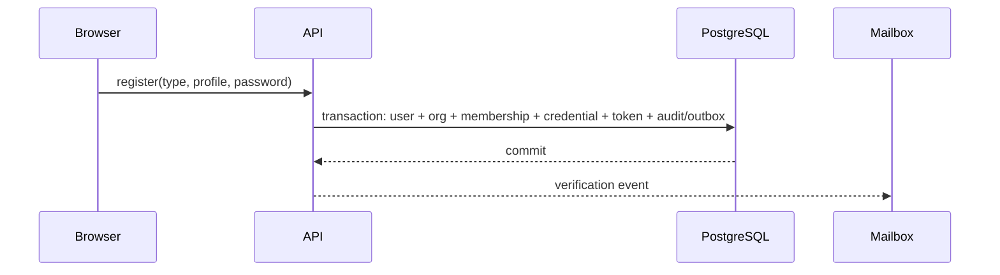
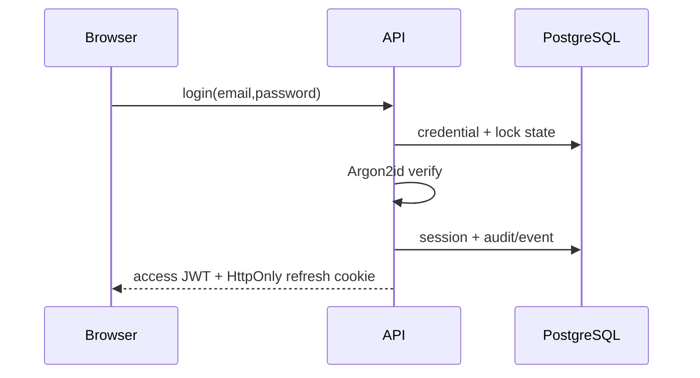
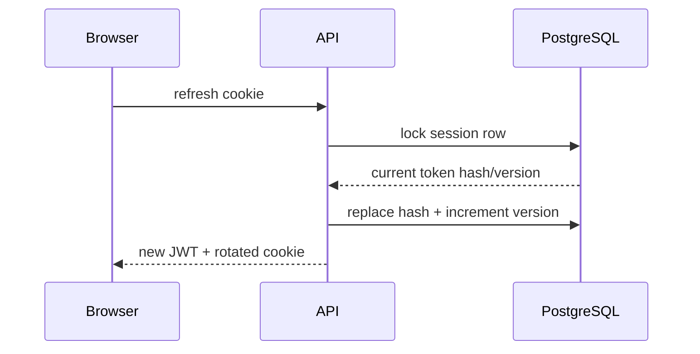

# Authentication

RoboWorkPool uses Argon2id password hashes, 15-minute HS256 access JWTs, and opaque
30-day rotating refresh tokens. Only SHA-256 refresh-token hashes are persisted.
Browser refresh tokens belong in an HttpOnly, Secure (production), SameSite=Lax
cookie scoped to auth routes. Access claims contain only user, session, version,
issuer, audience, issue, and expiry data; current authorization is loaded server-side.

Rotation locks the session row. A successful refresh moves the current hash to the
single-use previous slot and increments the token version. Presenting that rotated
hash marks the family compromised. Logout revokes the server session; cookie clearing
is only a client cleanup.

Verification and password-reset tokens are 256-bit opaque values stored as SHA-256
hashes. They expire, are single-use, and are consumed transactionally. Reset completion
must revoke every session. Password changes trigger Argon2 rehash when parameters age.

