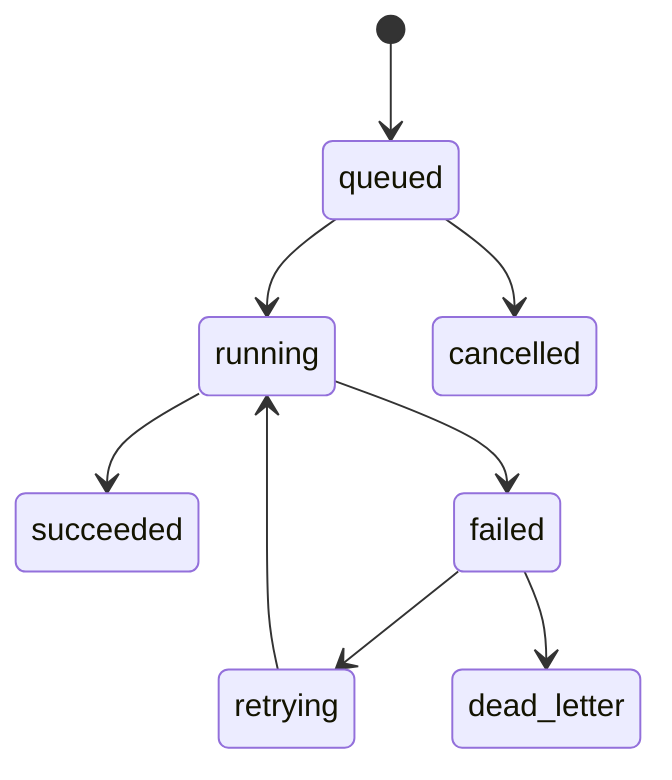

# Background workers

Definitions describe supported retry, cancel, pause, and criticality semantics. Runs preserve safe payloads, results, timing, retry lineage, and failure categories. Worker heartbeats project current queue and process health. Pausing a definition prevents optional new work; it does not terminate critical work already running.

