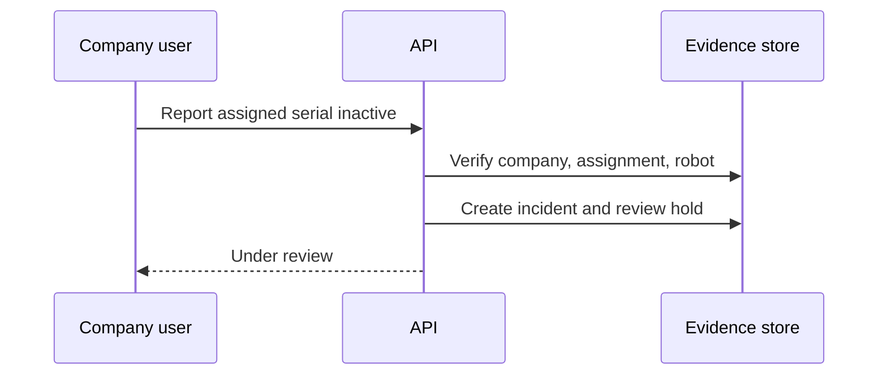

# Company Inactivity Reporting

An authorized Hiring Company member may report only the robot on its assignment,
using the physical manufacturer's serial number. The report creates an incident and
holds unfinalized evidence for review. It never deletes evidence or automatically
removes finalized time.

