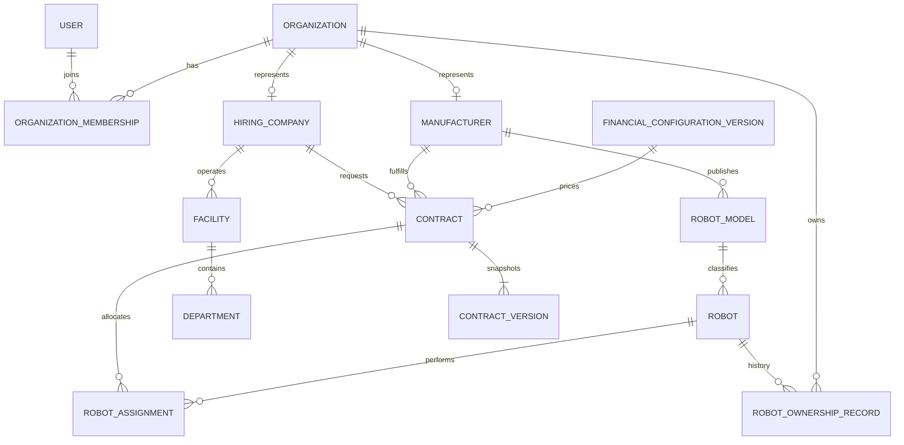

# RoboWorkPool Core Domain Model

Prompt 002 establishes the persistent system of record. IDs are UUIDs; timestamps
are UTC `timestamptz`; mutable aggregates carry explicit status and version fields.

Robot state is deliberately multidimensional: registration, ownership, activation,
heartbeat, operation, maintenance, compliance, financial eligibility, and final
lifecycle state are independent columns.

Contracts are aggregates; `contract_versions` are immutable snapshots. Assignments
bind one robot, one contract version, the verified owner at assignment time,
manufacturer, hiring company, facility, and optional department.

Database invariants include unique normalized serials per manufacturer,
non-overlapping verified ownership and live assignment periods, one active financial
configuration at a time, append-only audit/version rows, and referential integrity.
The 20-active-robot ownership limit is also enforced by a transactional domain guard.

