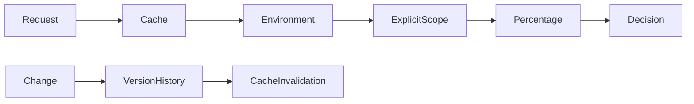

# Feature flags

Flags are evaluated server-side by environment. Safe default is disabled. Explicit user and organization scopes precede deterministic percentage rollout. Snapshots are cached briefly and invalidated after changes. Each mutation increments a version and records its previous state, reason, actor, audit, and outbox event.

