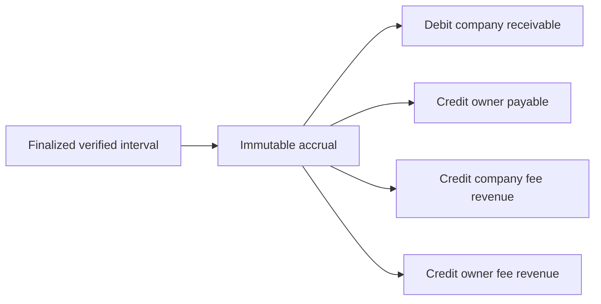

# Financial Ledger

Each finalized accrual posts a balanced journal:

Posting is rejected unless debits equal credits and at least two lines exist.
Posted entries and lines are immutable. Corrections use reversals.

