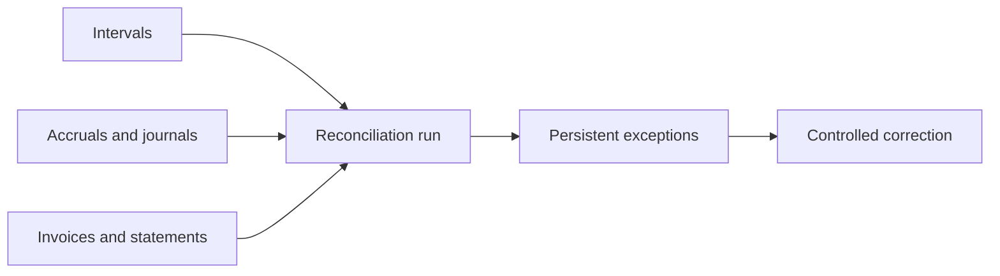

# Financial Reconciliation

Reconciliation records missing accruals, missing journals, imbalance, duplicate
document association, total mismatches, and settlement duplication as explicit
exceptions. It never silently repairs history.

