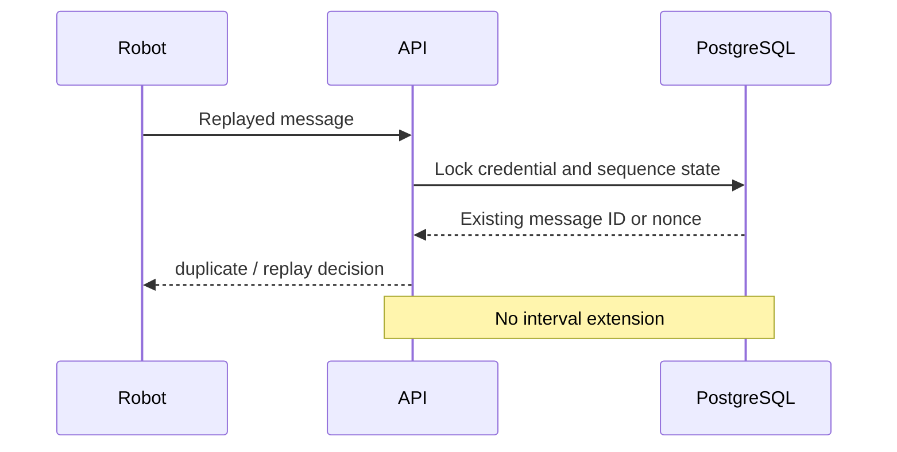

# Heartbeat Replay Protection

Each credential has unique message-ID and nonce-hash constraints plus a locked
sequence projection. A configurable reorder window permits limited network disorder
without accepting old sequences. Timestamp limits block future and stale batches.
Duplicate evidence is idempotent and never extends an operating interval.

