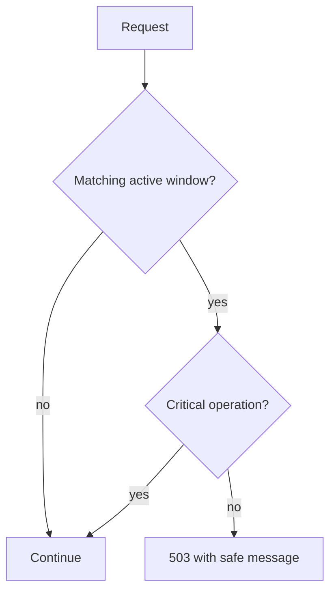

# Maintenance mode

Maintenance may target the platform, one organization, or a subsystem. Existing sessions and critical workers continue; optional mutations are blocked by maintenance-aware middleware as subsystems adopt the shared check. Public announcements provide the banner. Enabling maintenance requires a single-use administrative step-up.

