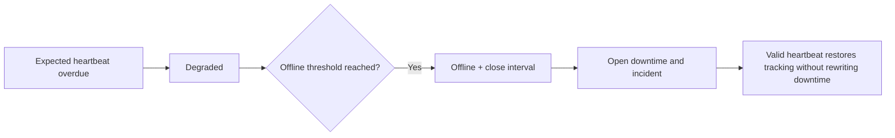

# Offline Detection

The idempotent offline worker locks due projections with `SKIP LOCKED`. A delayed
heartbeat first produces `degraded`; crossing `offline_after_at` marks the robot
offline/unavailable, closes its open verified interval, opens downtime, and creates
one automatic incident per robot, assignment, and incident type.

