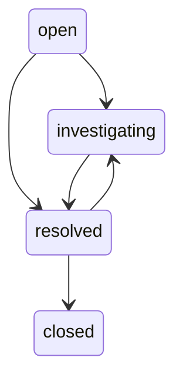

# Operations Center

The Operations Center combines organization, robot, contract, heartbeat, finance, payment, worker, and infrastructure posture. Global search groups safe results by entity type. Incidents follow an explicit workflow and may link to affected entities. Diagnostics store safe error summaries rather than secrets or raw payloads.


## Runtime observability

The protected `/api/v1/platform/metrics` endpoint exposes database-backed queue and control-plane gauges together with in-process request totals and duration summaries. Request labels use Fastify route templates rather than raw URLs, preventing entity identifiers from creating unbounded metric labels.

The heartbeat-offline and financial-finalization entry points record background job runs and worker heartbeats through the shared instrumentation layer. Long-running work refreshes its heartbeat every 30 seconds and records safe success or failure details.

Run alert evaluation from a scheduler with:

```sh
pnpm operations:evaluate-alerts
```

New alerts publish `platform.operational_alert.opened` through the transactional outbox. An outbox publisher may route that event to email, paging, chat, or another incident-management destination without coupling those providers to alert evaluation.