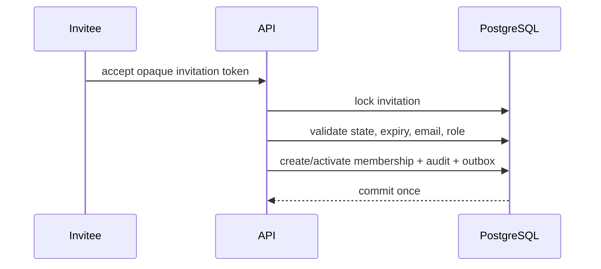

# Organization Onboarding

Public onboarding permits Robot Owner, Hiring Company, and Manufacturer organizations
only. Registration atomically creates the pending user, organization, founding
membership, appropriate company profile, credential, verification token, audit, and
outbox event. Robot Owners begin as `owner`; company founders as `administrator`.

Manufacturer production access remains disabled and Hiring Company verification and
billing remain pending. Email verification activates identity, not production rights.
Invitation acceptance locks the invitation and validates matching verified email.

