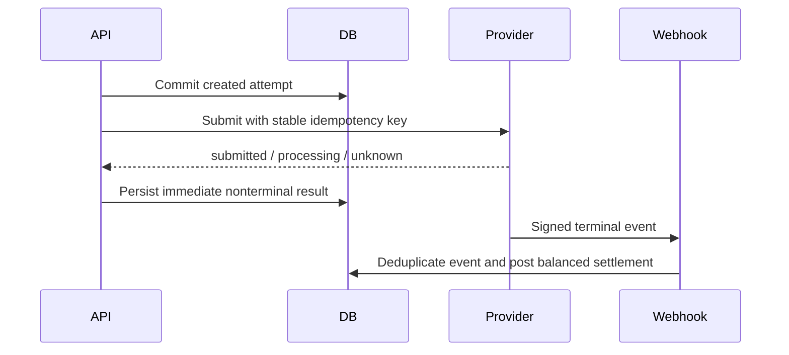

# Payment architecture

RoboWorkPool uses a provider-neutral `PaymentProvider`. The internal double-entry ledger is authoritative for receivables, owner payables, fees, holds, credits, and invoice balances. The configured processor is authoritative only for external money movement. A submitted collection is not settled, and a submitted payout is not paid.

The initial funds flow collects company funds into Nation Reserve's platform account and processor-clearing account. Owner payouts are separate obligations sent through hosted connected accounts; a company collection is never directly split into a particular owner payout. Legal counsel and the processor must approve the final marketplace, custody, reserves, escheatment, and money-transmission model before live launch.

Test and live IDs are isolated by provider environment. Secrets and raw payloads are never persisted or logged.