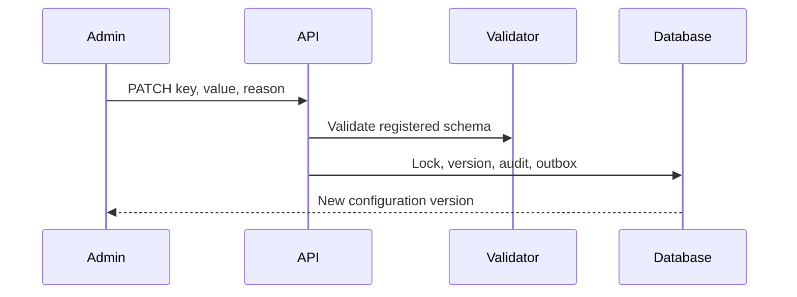

# Platform configuration

Central configuration is categorized and environment-specific. Only registered keys are editable; each value passes its key-specific Zod schema. Updates require a reason, increment a version, preserve history, and create audit/outbox records. `requires_restart` communicates deployment implications but never silently restarts services.

