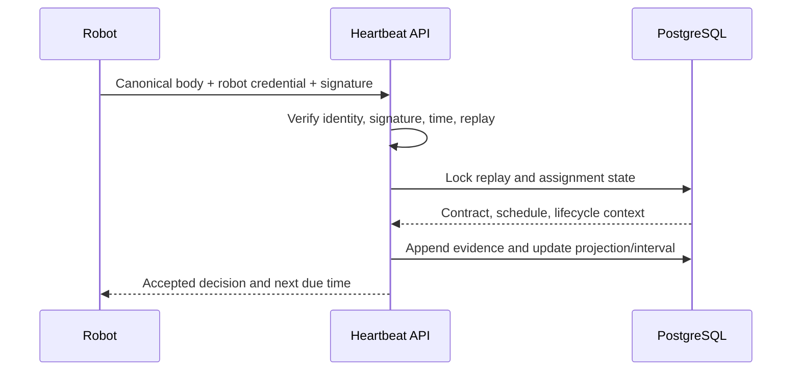

# Production Heartbeat

`POST /robot-api/v1/heartbeat` accepts robot-specific, signed production evidence.
Manufacturer-wide credentials may provision a robot credential but cannot submit
heartbeats on behalf of arbitrary robots. No external tracking device is required.

Processing validates body size, schema/API version, credential state, robot and
serial identity, signature, timestamp, message ID, nonce, sequence, model-owned
state mapping, assignment, contract, schedule, and lifecycle eligibility. Accepted
messages can remain noneligible. A network connection, activation, assignment, or
schedule alone never creates verified time.

