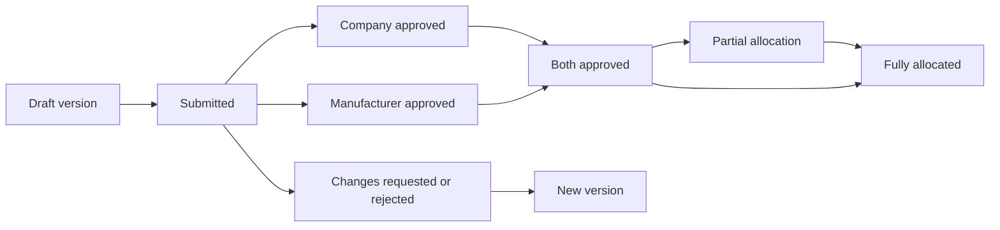

# Prompt 005 — Contracts, Scheduling, Allocation, and Assignments

## Delivered scope

Prompt 005 adds the first operational demand workflow:

- Hiring Companies create versioned contract requests for a facility, optional
  department, approved manufacturer, robot models, quantities, term, and schedule.
- Hiring Company and manufacturer approvals are independent. A revision becomes
  approved only after both parties approve the same version.
- Changes requested and rejection require a reason and are recorded as immutable
  approval events. Material changes create a new version.
- Approved contract versions can receive full or partial robot allocations.
- Each assignment binds one eligible robot, its verified owner, the approved
  contract version, location, and scheduled interval.
- Assignments begin as `ready` with `financial_status = not_eligible`. Schedules
  and assignments never create payable time; verified heartbeat processing belongs
  to a later prompt.
- Replacement and cancellation preserve assignment history and emit audit/outbox
  events.

## Lifecycle

Approved and superseded versions cannot be updated or deleted. Draft/submitted
versions may only receive workflow fields; business-term changes use a new version.

## Eligibility and concurrency

Allocation requires a registered, ownership-verified, activated, active, compliant,
available robot with no maintenance hold. The manufacturer and requested model must
match, and an overlapping live assignment is rejected. Allocation runs in a
transaction and locks contract/version state before creating assignments. Database
constraints and indexes are the final protection against duplicate or conflicting
records.

## API surface

Routes are organization-scoped under `/api/v1/organizations/:organizationId`:

- `/company/contracts` — list and create
- `/company/contracts/:contractId` — detail, revision, submission, decision
- `/manufacturer/contracts` — list and detail
- `/manufacturer/contracts/:contractId/decision` — approve, request changes, reject
- `/manufacturer/contracts/:contractId/allocations` — allocate eligible robots
- `/assignments/:assignmentId` — detail
- `/assignments/:assignmentId/replace` and `/cancel` — lifecycle actions

Every operation authenticates the user and verifies organization membership and
the relevant company/manufacturer relationship in the service layer.

## Explicitly deferred

Heartbeat ingestion, payable-time determination, payroll, invoices, billing,
payments, and maintenance execution remain outside Prompt 005.

