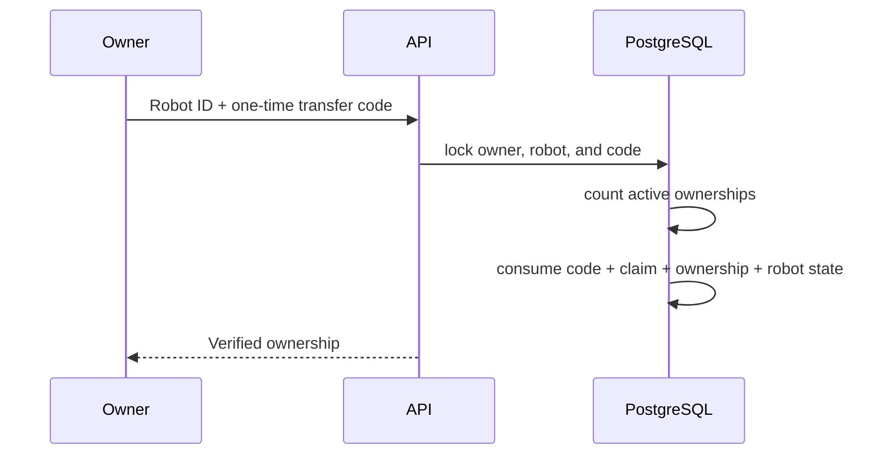

# Robot Ownership Claims

Transfer codes are random, hashed, expiring, revocable, and single-use. The transaction
locks the owner and directly enforces the 20-active-robot maximum. Lost, stolen,
suspended, faulted, and maintenance robots count; retired, decommissioned, and
destroyed robots do not.

