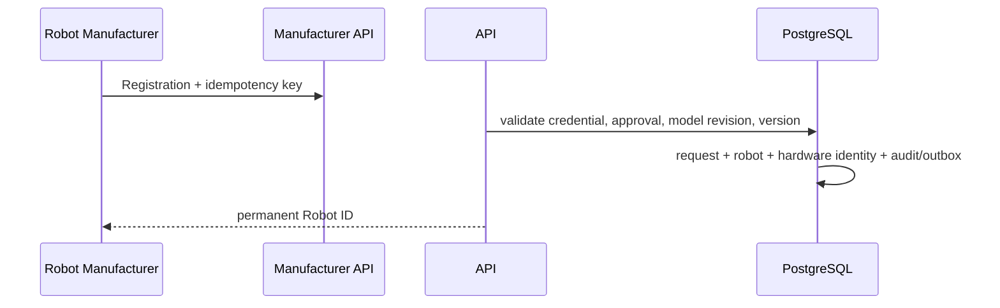

# Robot Registration

Registration normalizes serials, enforces manufacturer uniqueness, hashes secret
hardware identity, and begins unowned, inactive, unavailable, and nonpayable. It does
not establish ownership, allocation, assignment, work, or financial eligibility.

