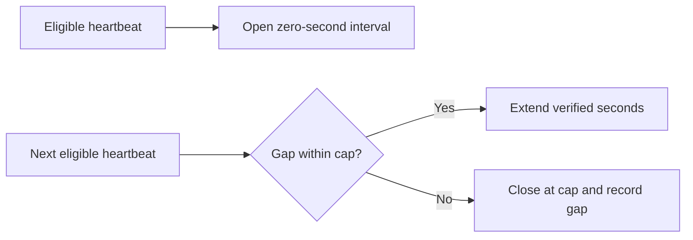

# Verified Operating Time

Only continuous, eligible heartbeat evidence creates verified operating seconds.
The first heartbeat opens an interval at zero seconds. Later eligible evidence
extends it by the observed gap, capped at expected interval plus grace. Larger gaps
close the prior interval at the cap and start new evidence from the later heartbeat.
Assignment and schedule windows use `[start, end)` semantics.

Finalized intervals are immutable. Corrections supersede records. Intervals retain
owner, manufacturer, company, contract/version, assignment, facility, department,
and financial-configuration attribution but contain no dollar calculation.

